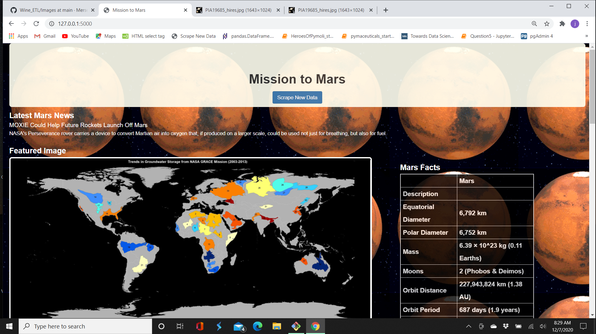

# Mission to Mars 
-----

The app has the capability for the images to shrink as the screen size is minimized.

## Programs Utilized:

1. **app.py** - Flask Application.
1. **scrape_mars.py** - Python code to scrape the mars website.
1. **mars.css** - Cascading style sheet used in index.html.
1. **index.html** - Html code which displays the page and data.

## Jupyter Notebook

1. **mission_to_mars.ipynb**

## Screen shots of my final application:

-----

